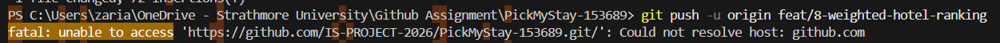
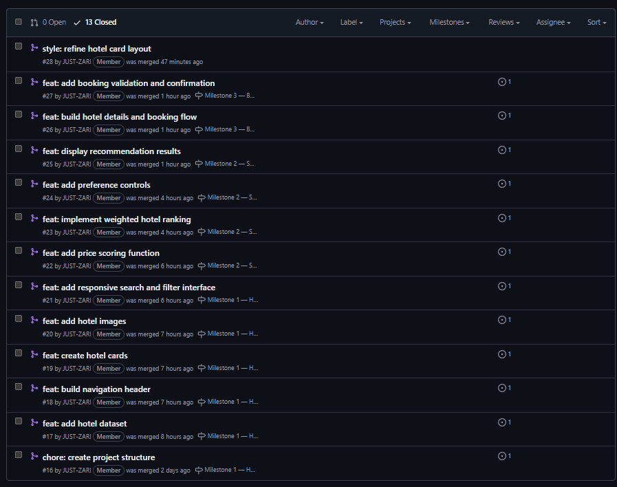
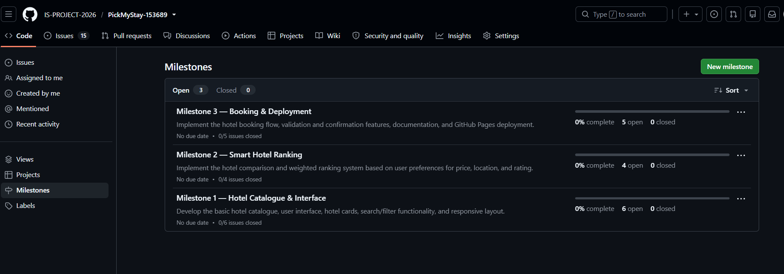
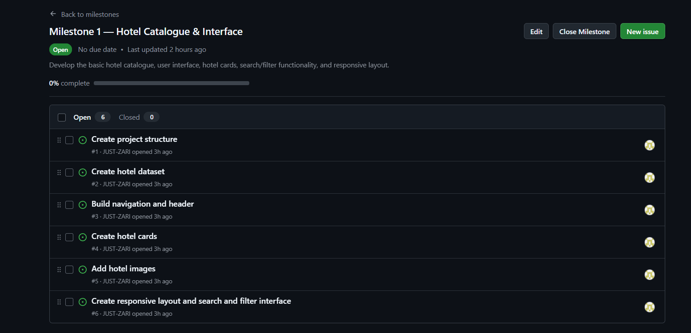
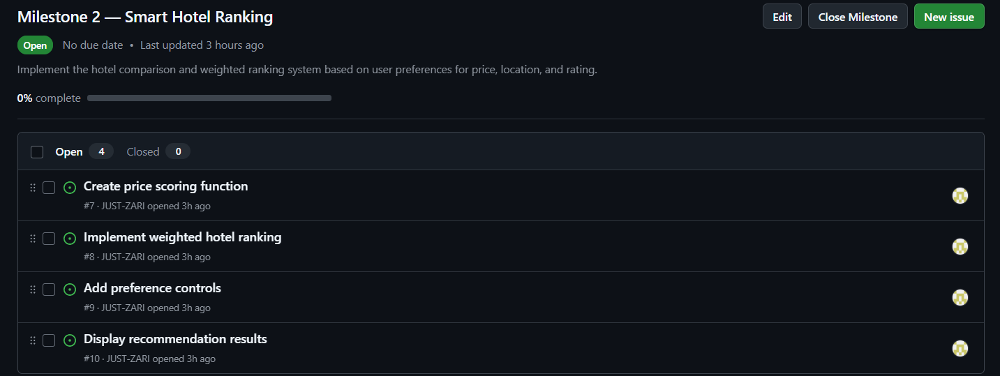
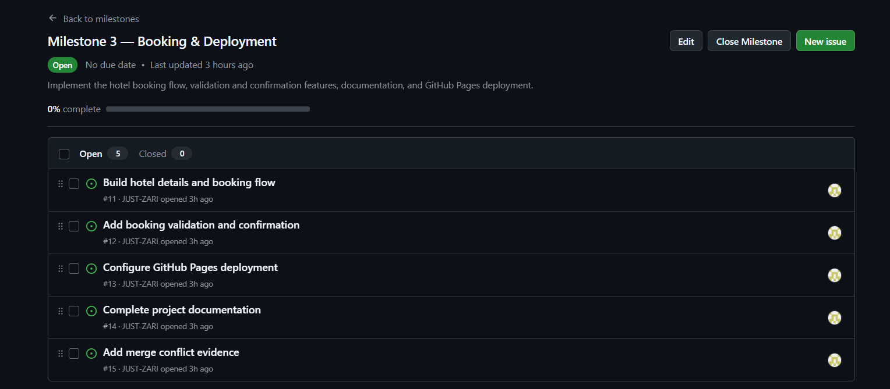
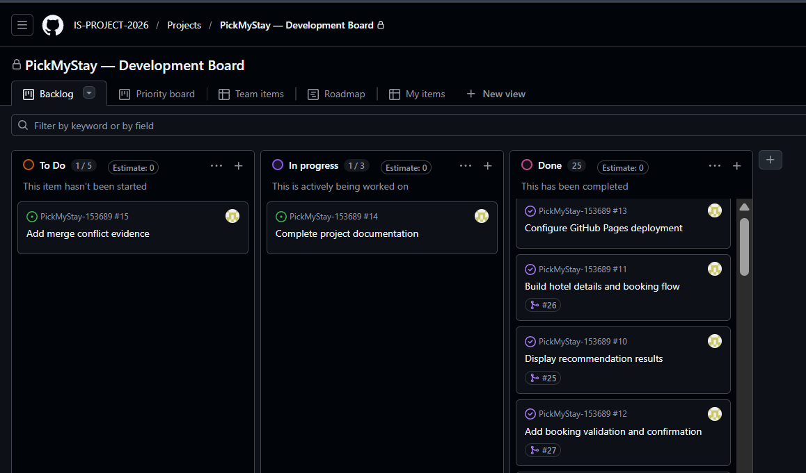
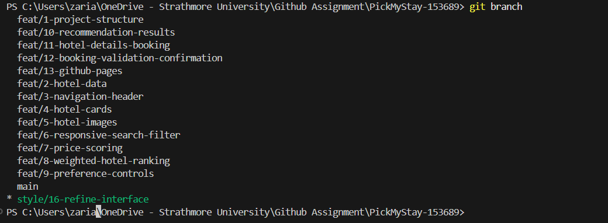
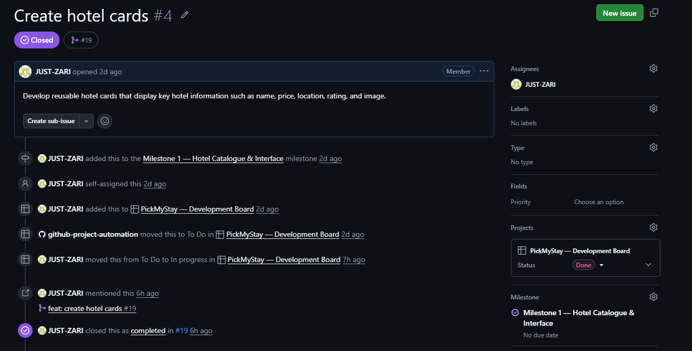

# Project Submission Report

## 1. Student Details

* **Full Name:** Zarian Achieng' Ochieng'
* **GitHub Username:** JUST-ZARI
* **Email:** zarian.ochieng@strathmore.edu

---

## 2. Deployed Project Link

* **Live GitHub Pages URL:**https://is-project-2026.github.io/PickMyStay-153689/

---

## 3. Reflection — Grounded in Your Git History

### A. Your Best Commit

* **Commit URL:** https://github.com/IS-PROJECT-2026/PickMyStay-153689/commit/ed86e9d4349054a8421d7f79c0bd735804760fa9
* **Why this one?** This commit demonstrates a clear Conventional Commit message and contains a focused change for implementing the weighted hotel ranking functionality. The change is isolated to the feature branch and has a clear relationship with the corresponding GitHub issue.

### B. A Mistake or Struggle

* **Link to the evidence:** https://github.com/IS-PROJECT-2026/PickMyStay-153689/pull/23

* **What happened and how did you recover?** I successfully committed the weighted hotel ranking changes locally, but the first attempt to push the `feat/8-weighted-hotel-ranking` branch failed with a `Could not resolve host: github.com` error. The problem was a network/DNS connectivity issue rather than a problem with the commit itself, so I kept the existing commit and retried the push once GitHub connectivity was available instead of creating another unnecessary commit.

### C. A Pull Request You're Proud Of

* **PR URL:** https://github.com/IS-PROJECT-2026/PickMyStay-153689/pull/22
* **What did you check before merging?** I reviewed the changed script.js code to confirm that the price scoring function was implemented correctly, checked that the changes were limited to the intended functionality, and verified that the PR correctly linked to Issue #7 before merging it into main.

### D. One Thing You Would Do Differently

* **What would you change?** I would plan the Conventional Commit types earlier instead of relying heavily on feat and chore. I would intentionally use appropriate types such as style and fix throughout development so that the commit history demonstrates a wider range of professional Git practices from the beginning.
* **Link to the evidence of the original decision:** (https://github.com/IS-PROJECT-2026/PickMyStay-153689/pulls?q=is%3Apr+is%3Aclosed)

---

## 4. Screenshots of Key GitHub Features

### A. Milestones and Issues

**Caption:** Overview of the three development milestones created for PickMyStay

**Caption:**The Hotel Catalogue & Interface milestone contains issues covering the initial project structure, hotel data, interface components, images, responsiveness, and search/filter functionality.

**Caption:**The Smart Hotel Ranking milestone contains issues for implementing hotel scoring, weighted ranking, user preference controls, and recommendation results.

**Caption:**The Booking & Deployment milestone contains issues covering the booking flow, validation, confirmation, GitHub Pages deployment, documentation, and merge conflict evidence.

### B. Project Board

* **Caption:** The Kanban project board tracks development tasks through the To Do, In Progress, and Done stages.

### C. Branching Architecture

* **Caption:** The repository uses issue-linked feature branches to isolate development work from the protected main branch.

### D. Pull Requests & Traceability

* **Caption:** Pull request for developing reusable hotel cards that display key hotel information such as name, price, location, rating, and image.
---

## 5. Merge Conflict Evidence

### Conflict 1 — Full Chronology

**What cause did you use?** Same-line modification conflict.

#### Step 1: Generating the Clash

* **Caption:** The merge attempt between the two feature branches produced a conflict because both branches modified the same section of `script.js`.

#### Step 2: Inside the Code Editor (Conflict Markers)

* **Caption:** Git identified conflicting changes to the same line in `script.js`. The current branch added the `ranked-card` class while the incoming branch added the `featured-card` class, producing the merge conflict markers.

#### Step 3: Resolution & Clean Merge

* **Caption:** The conflicting changes were manually combined into a single valid implementation, the conflict markers were removed, and the merge was completed successfully with a clean working tree.

### Conflict 2 — Different Cause

**What cause did you use?** Add/Add conflict — both branches independently created the same file.

**Why does this cause trigger a conflict?** This conflict occurs when two branches create a file with the same name and path, but Git cannot automatically decide which version of the newly created file should be kept.

[To be completed later.]

* **Caption:** Both branches independently created `conflict-2.txt`, resulting in an add/add conflict when the branches were merged. Git displayed conflict markers because the two newly created versions contained different content.

### Conflict 3 — Different Cause

**What cause did you use?** [To be completed later.]

**Why does this cause trigger a conflict?** [To be completed later.]

[To be completed later.]

* **Caption:** [To be completed later.]

---

## 6. Feedback & Evaluation

* **Anonymous Evaluation Form:** [Course & Instructor Evaluation]

---

## Final Submission

The completed project will be submitted through the official course submission form before the stated deadline.
